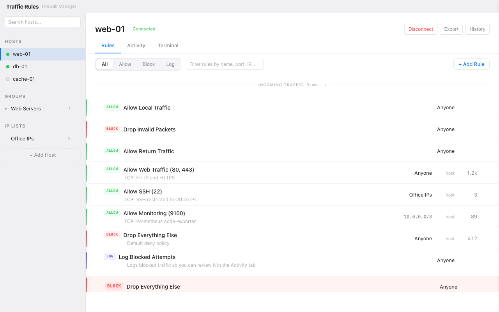

# Traffic Rules

A desktop app for managing iptables on remote Linux servers via SSH.

Built with Tauri 2.x (Rust backend + vanilla TypeScript frontend).

## What it does

- Connect to Linux servers via SSH
- View, create, edit, delete firewall rules through a GUI
- Apply changes with a 60-second safety timer (auto-reverts if connection lost)
- Monitor traffic: hit counters, blocked log, connection tracking
- Export rules as shell script, Ansible playbook, or iptables-save format
- Manage multiple hosts with groups and shared rules

## Screenshot



- **Sidebar**: hosts with status indicators, groups, IP lists
- **Rule table**: colored action badges (green=allow, red=drop), hit counts, drag-to-reorder
- **Side panel**: rule detail/edit, port forwarding, source NAT builders
- **Activity tab**: live hit counters with sparklines, blocked traffic log
- **Terminal tab**: raw iptables editor, packet tracer, SSH command log

## Quick start

### Prerequisites

- [Rust toolchain](https://rustup.rs/) (stable)
- [Node.js](https://nodejs.org/) 18+
- OpenSSH client on your machine

### Development

```bash
git clone https://github.com/lifeart/iptables-manager.git
cd iptables-manager
npm install
npm run tauri dev
```

This starts the Tauri app with hot-reload. The app loads demo data (3 hosts, rules, hit counters) so you can explore the UI without connecting to a real server.

### Browser-only mode (no Tauri)

```bash
npx vite --port 1420
```

Opens at `http://localhost:1420`. All IPC calls use mock data. Good for frontend development.

## Build

### macOS

```bash
npm run tauri build
```

Produces `src-tauri/target/release/bundle/dmg/Traffic Rules_0.1.0_aarch64.dmg` (Apple Silicon) or `x64.dmg` (Intel).

### Linux

```bash
npm run tauri build
```

Produces `.deb` and `.AppImage` in `src-tauri/target/release/bundle/`.

### Windows

```bash
npm run tauri build
```

Produces `.msi` in `src-tauri/target/release/bundle/msi/`.

## Project structure

```
├── src/                    # Frontend (TypeScript)
│   ├── components/         # UI components (sidebar, rule-table, dialogs, etc.)
│   ├── store/              # State management (actions, reducers, selectors)
│   ├── services/           # Rule merge, templates, theme, shortcuts
│   ├── ipc/                # Tauri IPC bridge with mock mode
│   ├── db/                 # IndexedDB persistence
│   ├── mock/               # Demo data
│   └── styles/             # CSS (BEM, dark mode)
│
├── src-tauri/              # Backend (Rust)
│   ├── src/
│   │   ├── iptables/       # Parser, generator, diff, tracer, conflict detection
│   │   ├── ssh/            # Connection pool, command builder, credentials
│   │   ├── safety/         # Timer, lockout detection, HMAC
│   │   ├── host/           # Detection, persistence
│   │   ├── activity/       # Hit counters, blocked log, conntrack
│   │   ├── ipset/          # Atomic swap manager
│   │   ├── snapshot/       # Create, restore, list
│   │   ├── export/         # Shell, Ansible, iptables-save
│   │   └── ipc/            # Tauri command handlers
│   ├── scripts/            # revert.sh, expire-rule.sh
│   └── tests/              # 268 tests with fixtures
│
├── docs/
│   ├── ux/                 # 12 UX spec files
│   └── architecture/       # 6 architecture docs
│
├── test-server/            # Docker test environment
│   └── Dockerfile          # Ubuntu + iptables + SSH for testing
│
└── index.html              # Entry point
```

## Testing

### Rust tests

```bash
cd src-tauri
cargo test
```

268 tests covering: iptables parser (all match modules, system detection), generator (restore files, round-trip), diff engine, packet tracer, conflict detection, safety timer, SSH commands, ipset, export formats.

### TypeScript type checking

```bash
npx tsc --noEmit
```

### Integration testing with Docker

```bash
# Start test server (Ubuntu + iptables + SSH)
cd test-server
podman machine start  # or docker
podman build -t iptables-test-server .
podman run -d --name iptables-test --cap-add=NET_ADMIN -p 2222:22 iptables-test-server

# Setup SSH key auth
sshpass -p testpassword ssh-copy-id -p 2222 root@localhost

# Test
ssh -p 2222 root@localhost "iptables-save"
```

Then connect to `root@localhost:2222` in the app.

## Connecting to a real server

1. Click **+ Add Host** in the sidebar
2. Type `root@your-server-ip` (or `user@host:port`)
3. Click **Connect**
4. The app connects via SSH, fetches iptables rules, and displays them

Requirements on the remote server:
- SSH access (key-based auth recommended)
- `iptables` and `iptables-save` available
- Root or sudo access for iptables commands

## Key features

### Safety timer
Every rule change includes a 60-second safety window. If the SSH connection drops after applying rules, they automatically revert. You can't lock yourself out.

### Rule builder
Sentence-style rule creation: pick action (Allow/Block/Log), service (SSH, Web, PostgreSQL, WireGuard...), source (Anyone, IP list, specific IP), and the rule is created. Progressive disclosure reveals advanced options (rate limiting, custom conditions, block type).

### Templates
11 built-in templates: Web Server, Database, Mail, Bastion, Docker Host, NAT Gateway, VPN (WireGuard/OpenVPN), IPSec, Lockdown, Minimal. Each creates a complete working ruleset.

### Export
Export rules as:
- **Shell script** — standalone bash script with iptables commands
- **Ansible playbook** — ready for automation
- **iptables-save** — raw format for `iptables-restore`

### Packet tracer
Test how a packet would be processed: enter source IP, destination, port, protocol — see which rule matches and why.

## Tech stack

| Layer | Technology | Lines |
|-------|-----------|-------|
| Frontend | Vanilla TypeScript, CSS | ~20k |
| Backend | Rust (Tauri 2.x) | ~12k |
| SSH | `openssh` crate (subprocess) | — |
| State | Custom store with selector subscriptions | — |
| Persistence | IndexedDB (browser) | — |
| Credentials | OS keychain via `keyring` crate | — |
| Drag & drop | SortableJS | — |

## Live demo

Try the app in your browser (no install required):
**[https://lifeart.github.io/iptables-manager/](https://lifeart.github.io/iptables-manager/)**

The demo runs with mock data — 3 sample hosts, firewall rules, hit counters, and snapshots.

## Releasing

1. Bump the version in all three files:
   - `package.json` (`version`)
   - `src-tauri/Cargo.toml` (`version`)
   - `src-tauri/tauri.conf.json` (`version`)
2. Update `CHANGELOG.md` with the new version and changes
3. Commit and tag:
   ```bash
   git add -A && git commit -m "release: v0.2.0"
   git tag v0.2.0
   git push origin master --tags
   ```
4. The release workflow builds macOS (.dmg), Linux (.deb, .AppImage), and Windows (.msi) artifacts and creates a **draft** GitHub Release at [github.com/lifeart/iptables-manager/releases](https://github.com/lifeart/iptables-manager/releases)
5. Review the draft, edit release notes if needed, then publish

## License

MIT
